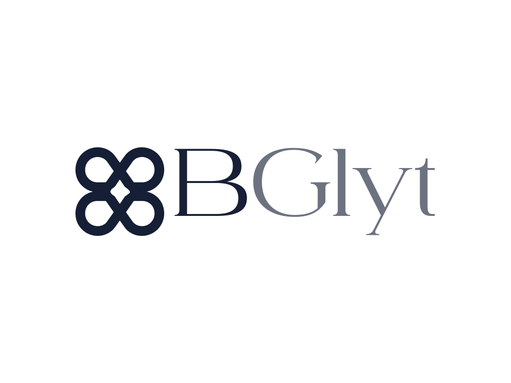

# 

  <strong>High-Fidelity AI Background Removal Web App</strong>

---

## Features

- **AI Background Removal:** High-fidelity background removal with precise transparency masking.
- **Before/After Slider:** Interactive comparison swipe layout.
- **File Specifications:** Real-time size, resolution, and processing speed metadata display.

---

## Tech Stack

- Python
- FastAPI
- rembg Library
- Next.js (React 19)
- TypeScript
- Tailwind CSS v4
- Lucide Icons
